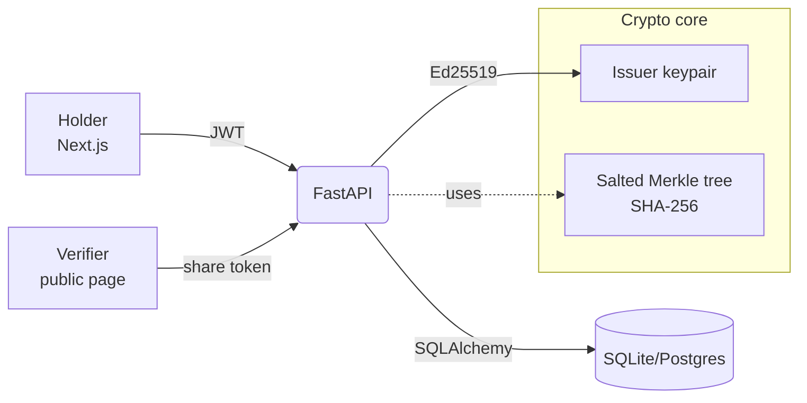
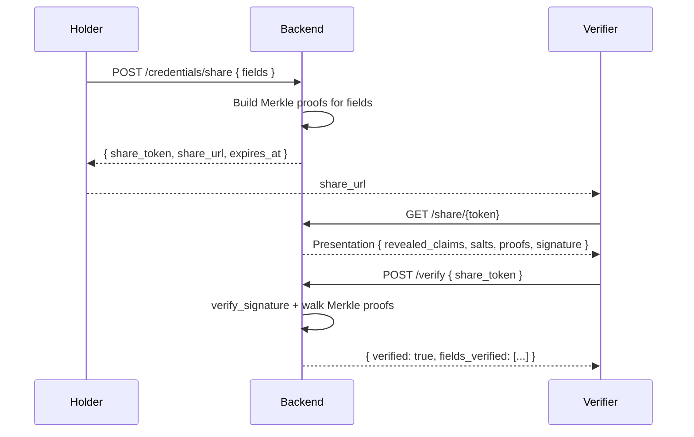

# Architecture

```mermaid
flowchart LR
  H[Holder<br/>Next.js] -- JWT --> B(FastAPI)
  V[Verifier<br/>public page] -- share token --> B
  B -- SQLAlchemy --> DB[(SQLite/Postgres)]
  B -- Ed25519 --> K[Issuer keypair]
  subgraph Crypto core
    K
    M[Salted Merkle tree<br/>SHA-256]
  end
  B -. uses .-> M
```

## Request flow — selective share

```mermaid
sequenceDiagram
  participant H as Holder
  participant B as Backend
  participant V as Verifier

  H->>B: POST /credentials/share { fields }
  B->>B: Build Merkle proofs for fields
  B-->>H: { share_token, share_url, expires_at }
  H-->>V: share_url
  V->>B: GET /share/{token}
  B-->>V: Presentation { revealed_claims, salts, proofs, signature }
  V->>B: POST /verify { share_token }
  B->>B: verify_signature + walk Merkle proofs
  B-->>V: { verified: true, fields_verified: [...] }
```
